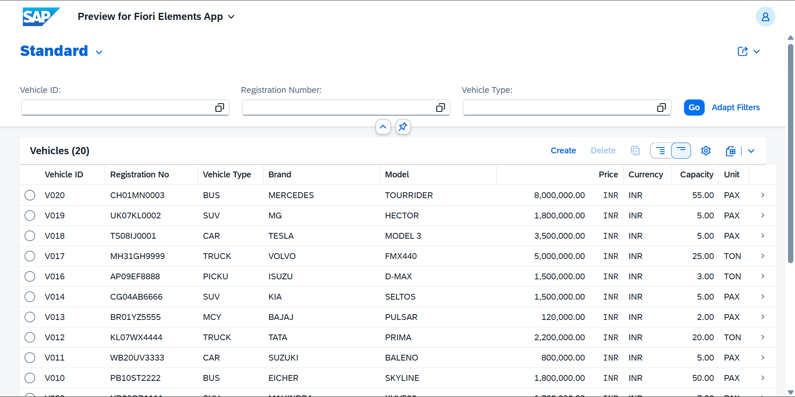
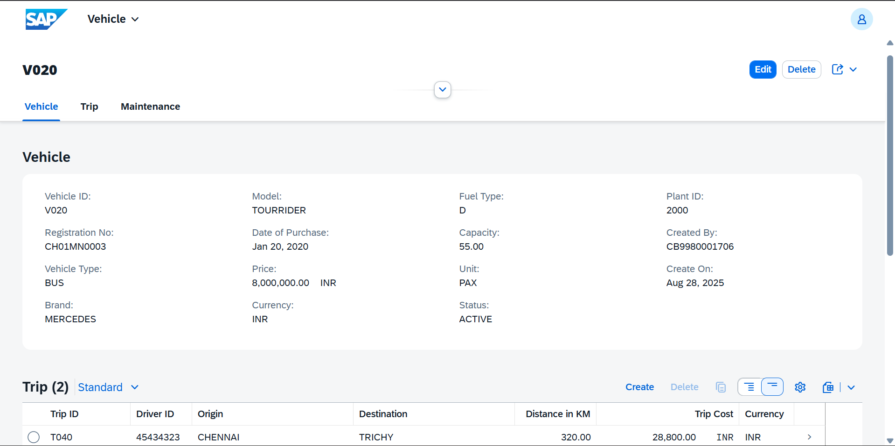
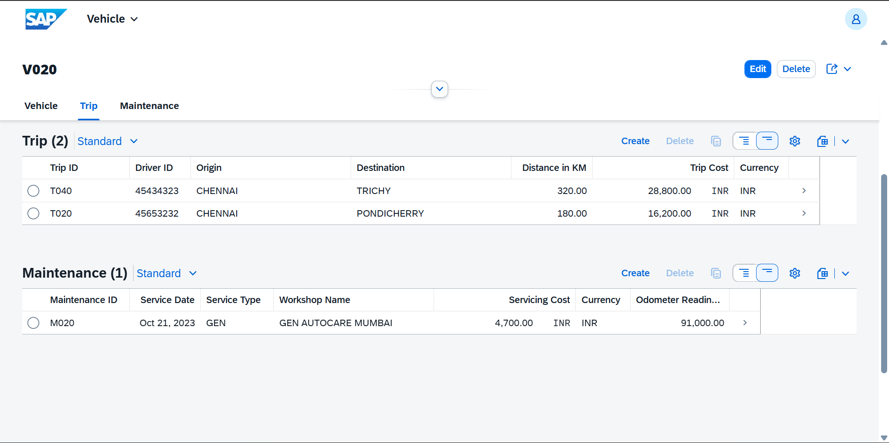
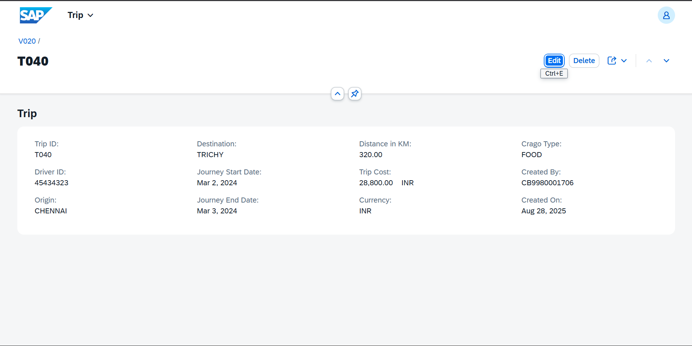
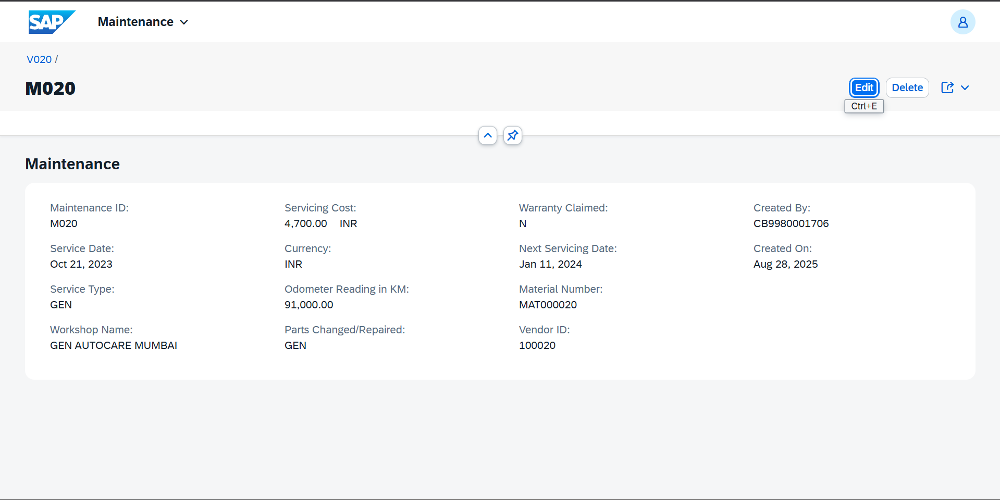
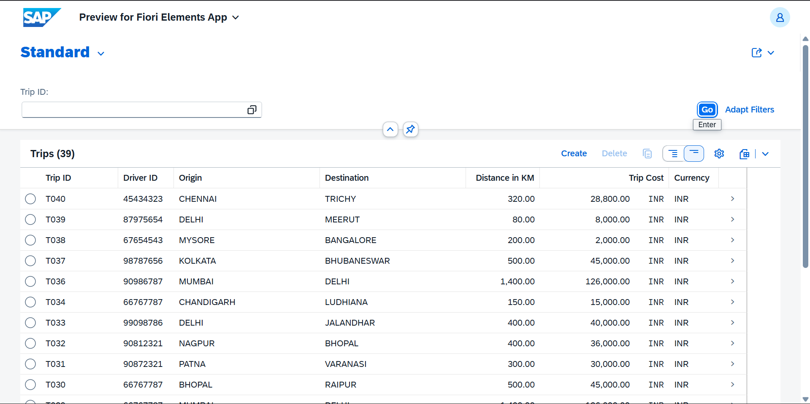
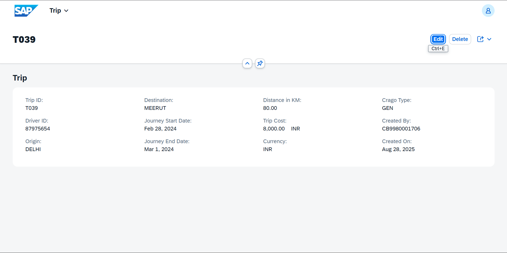
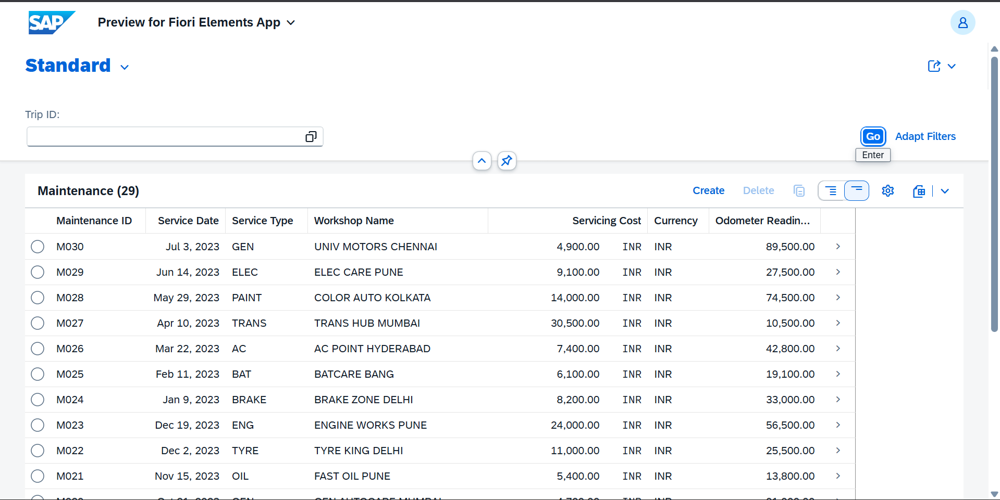
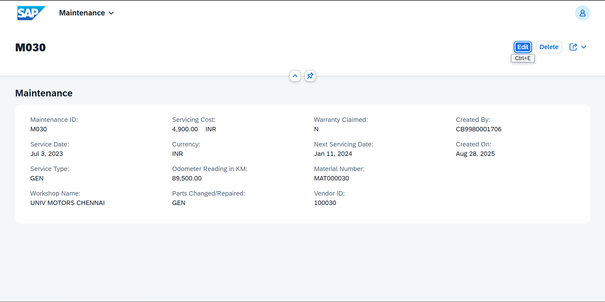

# 🚚 Fleet Management System (ABAP RAP Version 1)

The **Fleet Management System** is a comprehensive full-stack application built with the **ABAP RESTful Application Programming Model (RAP)**. It empowers organizations to efficiently manage their fleet of vehicles, trips, and maintenance activities using a modern, Fiori-based user experience.  
This solution follows RAP's **Managed Scenario** to ensure maintainability, reusability, and clean, scalable architecture.

---

## 📌 Key Features

- **Vehicle Master Data**: Manage vehicles with details like type, fuel, brand, model, price, and operational status.  
- **Trip Management**: Track trips, including distance, origin/destination, cargo type, and cost calculations.  
- **Maintenance Scheduling**: Schedule and log service history, including costs, parts, and next service dates.  
- **Automated Trip Cost Calculation**: Calculates trip costs dynamically based on fuel type and distance.  
- **Intuitive Fiori Elements UI**: Ready-to-use UI with facets, line items, selection fields, and rich header info.  
- **OData Service Exposure**: Seamless integration for frontend apps and external consumers.

---

## 🏗️ Technical Architecture

### 📂 Custom Database Tables

- **`ZAKS_VEHICLE`** — Vehicle master data (e.g., vehicle ID, type, fuel, brand, model, price, status)  
- **`ZAKS_TRIP`** — Trip details (e.g., trip ID, vehicle/driver IDs, origin, destination, distance, cargo type)  
- **`ZAKS_MAINTENANCE`** — Maintenance (e.g., maintenance ID, vehicle ID, service date/type, workshop, cost, parts, next service, vendor)  

**Data Initializer:**  
- **`ZAKS_FM_FILL`** — ABAP class to prefill sample data across all tables

---

### 📊 CDS Views

- **`ZAKS_CMP_CDS_TRIP`** — Computes **trip price** dynamically (based on fuel cost matrix: Petrol = 100, Diesel = 90, CNG = 70, Electric = 10)  
- **Interface Views:**  
  - **`ZAKS_I_ROOT_VEHICLE`** — Root view on vehicle table  
  - **`ZAKS_I_CDS_TRIP`** — Interface on computed trip CDS  
  - **`ZAKS_I_CDS_MAINTENANCE`** — Interface on maintenance table  
- **Modeling Highlights:**  
  - **Composition/Cardinality**: Root view composes trips and maintenance  
  - **Associations**: Trips and maintenance reference their parent vehicle

---

### ⚙️ Behavior Definitions

- **`ZAKS_I_ROOT_VEHICLE`** — Behavior definition for managed scenario  
  - Maps entities and compositions between vehicle, trip, and maintenance

---

### 📐 Projection Layer

- **Projection Views:**  
  - **`ZAKS_P_ROOT_VEHICLE`** — Projects root vehicle view  
  - **`ZAKS_P_CDS_TRIP`** — Projects trip view  
  - **`ZAKS_P_CDS_MAINTENANCE`** — Projects maintenance view  
- **Compositions & Redirections:**  
  - Root projection uses **redirected to composition**  
  - Trip and maintenance projections use **redirected to parent**  
- **Behavior Projection:**  
  - **`ZAKS_P_ROOT_VEHICLE`** — Behavior projection for root projection view

---

### 🎨 UI Annotations (Metadata Extensions)

- **`ZAKS_ME_VEHICLE`** — On root vehicle projection  
  - Header info, facets (Vehicle, Trip, Maintenance), line items, identification, selection fields, labels, and hidden fields  
- **`ZAKS_ME_TRIP`** — On trip projection  
  - Header info, facets, line items, identification, labels  
- **`ZAKS_ME_MAINTENANCE`** — On maintenance projection  
  - Header info, facets, line items, identification, labels

---

### 🌐 Service Layer

- **Service Definition:**  
  - **`ZAKS_SD_FLEET_MGMT`**  
    - Exposes:  
      - **Fleet** — `ZAKS_P_ROOT_VEHICLE`  
      - **Trip** — `ZAKS_P_CDS_TRIP`  
      - **Maintenance** — `ZAKS_P_CDS_MAINTENANCE`  
- **Service Binding:**  
  - **`ZAKS_SB_FLEET_MGMT`** — Binds service definition to **OData V2** for UI and external access

---

## 🖥️ Demo & Screenshots

Below are sample screenshots showcasing the Fleet Management System's Fiori UI and features:

### 🚛 Fleet Preview (Vehicle + Trip + Maintenance)

**Vehicle List**



**Vehicle Details**



**Trip & Maintenance Overview (Facets)**



**Fleet Trip Details**



**Fleet Maintenance Details**



---

### 📋 Standalone Trip Management

**Trip List**



**Trip Details**



---

### 🛠️ Standalone Maintenance Management

**Maintenance List**



**Maintenance Details**



---

*All screenshots are from the Fiori Elements app demonstrating master-detail navigation, list reports, and object pages for real-world fleet operations.*


## 📂 Repository Structure

```plaintext
fleet-management-system-rap-version1/
│── src/
│   ├── assets/                # Screenshots & demo images
│   ├── behavior/              # Behavior definitions (Managed Scenario)
│   ├── behavior_projections/  # Behavior projections
│   ├── cds/                   # CDS views (Interface & Computed)
│   ├── classes/               # ABAP classes (e.g., data initializer)
│   ├── data_elements/         # Data elements
│   ├── domains/               # Domains
│   ├── projections/           # Projection views
│   ├── service/               # Service definitions & bindings
│   ├── tables/                # Custom database tables
│   ├── ui/                    # Metadata extensions for UI annotations
│   └── package.devc.xml       # ABAP package definition
│
│── LICENSE                    # MIT License
└── README.md
```
---

## ⚡ Planned Enhancements

- RAP **Unmanaged Scenario** implementation  
- Role-based authorization and access control  
- Advanced KPIs and analytics dashboards

---

---

## 📖 Detailed Documentation

A complete step-by-step documentation of this project is available in the **GitHub Wiki**:  
👉 [Fleet Management System Wiki](https://github.com/iankitsinghk/fleet-management-system-abap-rap-v1/wiki)


---

## 📜 License

This project is licensed under the MIT License. See the [LICENSE](LICENSE) file for details.
